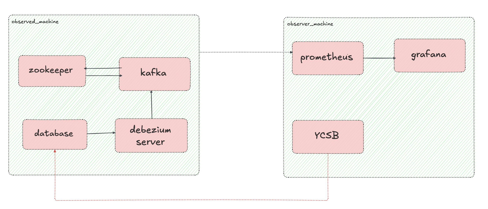

# DEBEZIUM PERFORMANCE BENCHMARKING

This repository contains tools, configurations, and test cases for evaluating the performance of [Debezium](https://debezium.io/), an open-source distributed platform for change data capture (CDC). The primary objective of this project is to benchmark Debezium's performance across various scenarios, including:

- Change event throughput (inserts, updates, deletes)
- Latency of change propagation
- Resource utilization (CPU, memory, network I/O)
- Scalability under load
- Performance across different connectors (MySQL, PostgreSQL...)

## Repository Structure

Here we have three main folders:

* container_images: This folder contains all the docker images used for different purposes: databases, ycsb, etc; all prepared to be run within this benchmarking framework.
* observed_machine: All the deployment and configurations needed to replicate a production ready environment, from which this framework gets and stores the data.
* observer_machine: Monitoring (prometheus + grafana) deployment and configuration and YCSB load deployments. 
* infrastructure_automation: Automates the deployment and configuration of the different machines

## Architecture Overview

If you want to have a clearer overview of the architecture, you can just take a look to the following image:



## Getting Started

### Prerequisites

With all the deployment automated, only the following points are needed to be installed/configured:

* An AWS account configured in your machine (with enough permissions to create EC2, security groups and key pairs)
* Terraform installed in your machine.
* Ansible and Ansible galaxy installed in your machine (the dependencies will be installed automatically)

### Spin up the machines

In order to start eveyrthing to work the following steps are needed:

1. Initialize terraform project.
2. Modify the default variables.tf file or create a .tfvars with your scenario preferences.
3. Execute the terraform project. 
4. Connect into the observer machine (command provisioned after the terraform)
5. Run the load scripts. 

```bash
    cd infrastructure_automation
    terraform init
    terraform apply (-var-file=”****.tfvars”)
    ssh *************
    cd observer_machine/****
    docker-compose up -d
```

## Benchmark Scenarios

With the actual configuration only streaming for MySQL is supported. But shortly more scenarios are going to become available. Until now the following performance scenarios are covered:

- Insert-heavy workloads
- Update-dominant streams
- Mixed CRU operations
- High-volume batch operations

## Metrics and Analysis

Database performance metrics are stored in the `results/` directory. Meanwhile the debezium and database behaviors are available at Grafana dashboards. There you can find all the information: 

- Throughput over time
- Lag and latency distributions
- Connector task performance
- Debezium metrics
- Database metrics

## Customization

This framework is highly configurable, you can go an edit it depending on your needs:
You can adjust test parameters, data schemas, and Debezium configurations to reflect your environment and requirements.

- All the Docker services are modifiable in each `docker-compose.yml` file.
- The different connectors configurations can be edited depending on your needs in `debezium_config/application.properties`.
- Docker image versions and environmental variables can be editted in the respective `.env` files. 

## Tracking the progress

Therer are still few things developed, if you want to improve this framewrok, please visit the [TODO document](./TODO.md) and pick any of the topics in there. 

## References

- [Debezium Documentation](https://debezium.io/documentation/)
- [YCSB](https://github.com/brianfrankcooper/YCSB)
- [Coordinated Omission](https://www.scylladb.com/2021/04/22/on-coordinated-omission/)
- [How Not To Measure Latency](https://qconsf.com/sf2012/dl/qcon-sanfran-2012/slides/GilTene_HowNotToMeasureLatency.pdf)

## Contribution

The Debezium community welcomes anyone that wants to help out in any way, whether that includes reporting problems, helping with documentation, or contributing code changes to fix bugs, add tests, or implement new features. See [this document](https://github.com/debezium/debezium/blob/7b8cceec8ada6b6a72122c17f0fa74985c1dae22/CONTRIBUTE.md) for details.
